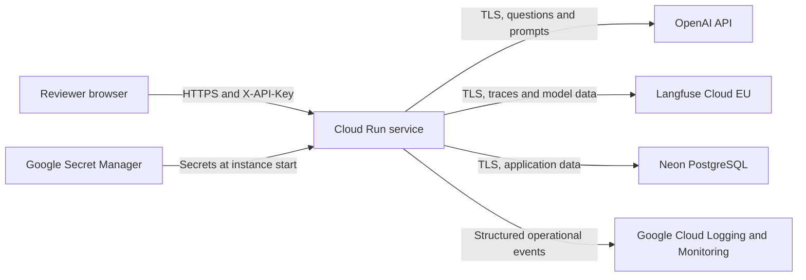

# Threat Model

## Purpose and scope

This document describes the security and privacy boundaries of the public Turbofan Maintenance
Intelligence Copilot demo. It covers the browser client, FastAPI application, Cloud Run deployment,
Neon PostgreSQL database, OpenAI generation API, Langfuse tracing, Google Cloud logging and monitoring,
and Secret Manager.

The system is an educational portfolio project. It is not certified maintenance software, does not
make airworthiness decisions, and must not be used as the sole basis for real maintenance work.

## Architecture and trust boundaries

The important trust boundaries are:

1. The public internet to Cloud Run. Cloud Run accepts public HTTPS requests, while the application
   requires a shared `X-API-Key` on all `/v1` endpoints.
2. Cloud Run to external processors. OpenAI receives prompts and returns model output. Langfuse receives
   questions, retrieved passages, prompts, model replies, token usage, and final answers.
3. Cloud Run to Neon. The application reads the corpus and sensor data and writes query and feedback
   records using a database credential supplied through Secret Manager.
4. Operators to cloud consoles. Anyone with access to the Google Cloud, Neon, OpenAI, or Langfuse
   accounts can reach data or controls beyond the public API boundary.

## Assets and data classification

| Asset | Classification | Where it exists |
|---|---|---|
| OpenAI, client, database, and Langfuse keys | Restricted secret | Secret Manager, Cloud Run process environment |
| Questions, answers, prompts, and feedback comments | Potentially sensitive user content | Neon, OpenAI, Langfuse |
| Retrieved handbook passages and citations | Public source content | Container memory, Neon, OpenAI, Langfuse |
| FD001 sensor readings and RUL outputs | Public research data | Neon, container memory, API responses |
| Request IDs, timings, token counts, outcomes, and costs | Operational metadata | Google Cloud logs, Neon, Langfuse |
| Image, source code, and dependency lockfile | Public software artifact | GitHub, Artifact Registry, Cloud Run |

Questions are not written to Cloud Logging. They are stored in `query_runs` and included in Langfuse
traces and OpenAI prompts. The chat page tells users that questions and answers are logged, but users
must still avoid entering personal, confidential, or regulated information.

## Security objectives

- Prevent unauthorised use of the owner's paid model account.
- Keep credentials out of source control, logs, browser persistence, and error responses.
- Prevent model or retrieved text from becoming executable browser content.
- Keep answers grounded in retrieved evidence and keep numerical engine outputs outside model control.
- Preserve enough request, cost, failure, and trace data to investigate misuse.
- Fail closed when authentication or required dependencies are missing.
- Make operational and safety limitations visible to users and reviewers.

## Threats, controls, and residual risk

| ID | Threat and impact | Current controls | Residual risk |
|---|---|---|---|
| T1 | A leaked shared client key permits unauthorised questions, feedback spam, and model spending. | Long random secret in Secret Manager, constant-time comparison, 401 on mismatch, 503 when unconfigured, tab-only `sessionStorage`, Cloud Run maximum of one instance, Cloud Run spend cap, and an OpenAI hard monthly limit. | High. The key identifies no individual, has no per-user quota, and can be copied by any authorised reviewer. There is no rate limiter. |
| T2 | Prompt injection in a question or retrieved passage attempts to override instructions, fabricate evidence, or manipulate output. | Retrieved text and questions are treated as untrusted, the model returns a structured schema, citations are reconstructed from passage numbers, unsupported questions can be refused, and the model has no write or administration tools. | Medium. Structured output limits shape, not factual persuasion. A cited answer can still misinterpret evidence. |
| T3 | Sensitive text entered by a user is disclosed through storage or third-party processing. | The UI warns that questions and answers are logged, Cloud logs omit question text, errors are generic, and secrets are not included in trace metadata. | High. Questions are retained in Neon and sent to OpenAI and Langfuse. No automated retention, deletion, or data-subject workflow exists. Users must not submit sensitive data. |
| T4 | Model output or malicious source text executes script in the browser. | The page inserts all dynamic content with `textContent`, never `innerHTML`; it is self-contained and loads no third-party scripts. A unit test enforces this boundary. | Low. A future UI framework or HTML-rendering feature could reopen the risk and requires a new review. |
| T5 | Secrets leak through the public repository, logs, errors, or cloud configuration. | `.env` is untracked, the public template contains placeholders, settings use `SecretStr`, application logs exclude secret values, production secrets live in Secret Manager, and the Cloud Run service account has accessor permission only on required secrets. | Medium. A container compromise can read its environment. Cloud account administrators can read or rotate secrets. |
| T6 | Database credentials are stolen or data is tampered with, deleted, or exfiltrated. | The connection requires TLS, the credential is stored in Secret Manager, public ingestion was removed, requests are schema-validated, and the application exposes no general database endpoint. | Medium. The application database user is not separated into narrowly scoped read and write roles. Backup and recovery have not been exercised. |
| T7 | Repeated requests cause denial of service or denial of wallet. | Authentication, a 2,000-character question limit, OpenAI timeout and retry limits, one maximum Cloud Run instance, cost telemetry, alerts, a Cloud Run spend cap, and an OpenAI hard limit constrain impact. | High. There is no request rate limit or per-key quota. One abusive holder can occupy the only instance and degrade service for everyone. |
| T8 | Authentication is bypassed or silently disabled by configuration error. | All `/v1` routers share the authentication dependency, missing configuration returns 503, equality uses `compare_digest`, readiness checks the client key, and unit tests cover missing, wrong, blank, non-ASCII, and valid keys. | Low. `/`, `/docs`, `/health`, and `/ready` remain public by design. |
| T9 | A public readiness request is abused to keep Neon awake and consume its free compute allowance. | The uptime monitor calls `/health`, not `/ready`, and readiness returns only terse status details. | Medium. `/ready` remains unauthenticated and performs a database check on every call. A production service should protect it at the platform or network boundary. |
| T10 | Crafted request IDs or log content forge records or break correlation. | Request IDs must be printable and at most 128 characters; logs are JSON encoded, which escapes newlines; the question text is excluded from operational logs. | Low. A caller can deliberately reuse an accepted request ID, so it is correlation data rather than an identity or proof of uniqueness. |
| T11 | A compromised or unavailable dependency disrupts answers or changes behavior. | Dependencies are locked, the embedding model revision is pinned and baked into the image, the image runs offline for embeddings, provider timeouts are bounded, readiness exposes dependency failure, and alerts cover server errors and availability. | Medium. Base images are tag-pinned rather than digest-pinned, automated vulnerability scanning is not enabled, and OpenAI, Neon, Google Cloud, and Langfuse remain trusted providers. |
| T12 | Users over-trust generated maintenance guidance or RUL estimates. | The README and UI identify the project as educational, answers carry source pages, unsupported questions can be refused, numerical engine health comes from deterministic code, and RUL output carries the model and typical error. | High for real-world misuse. The RUL error is an average over FD001 and is not a calibrated interval for one engine. Human review and approved maintenance documentation remain mandatory. |

## Existing verification

The repository includes tests that enforce important controls:

- `tests/unit/test_api_key.py`: closed-by-default authentication and constant behavior for invalid keys.
- `tests/unit/test_ui.py`: tab-only key storage, safe text rendering, and the logging notice.
- `tests/unit/test_api_errors.py`: generic, correlated error responses.
- `tests/unit/test_logging_setup.py`: JSON logging resists newline-based log forging.
- `tests/unit/test_query_telemetry.py`: question text is excluded from operational telemetry.
- `tests/unit/test_tracing.py`: tracing is disabled without both keys and preserves the request correlation ID.

Live verification has also covered Cloud Run health and readiness, authenticated queries, Secret Manager
injection, structured Cloud Logging events, alert delivery, and a complete Langfuse production trace.

## Accepted limitations for the public demo

The following are conscious limits, not hidden guarantees:

- One shared API key, with no user identity, revocation per reviewer, role model, or audit attribution.
- No application-level rate limiting or per-user spending quota.
- No automated retention or deletion policy for query, feedback, or tracing data.
- Public `/ready` and `/docs` endpoints.
- No tested database restoration procedure or formal availability target.
- No certification, clinical-style validation, or suitability for real maintenance decisions.

Before using the design for a real organisation, replace the shared key with individual identity, add
rate limiting and quotas, minimise database privileges, define retention and deletion rules, protect
readiness at the platform boundary, enable vulnerability management, and complete a provider and privacy
review.

## Incident response and review triggers

If a key is exposed, add a new Secret Manager version, deploy a fresh Cloud Run revision so the `latest`
version is loaded, disable the old version, and review query, cost, and trace activity. A leaked reviewer
key also requires distributing a replacement to intended reviewers.

Review this model whenever authentication, data retention, providers, public endpoints, browser
rendering, tools available to the model, or deployment topology changes. Review it immediately after a
credential leak, unexplained spending, unexpected trace content, or a safety-related answer failure.
